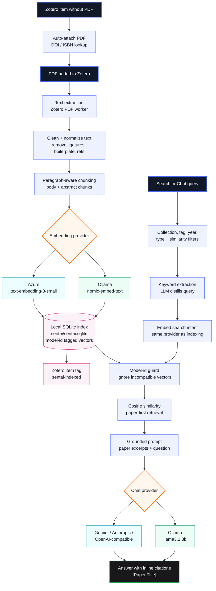
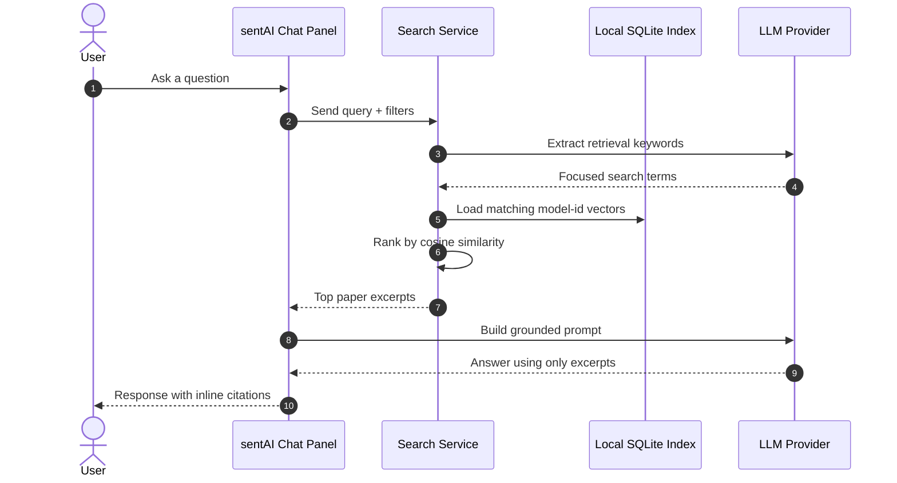

<div align="center">

# sentAI

**Semantic search for your Zotero research library**

[](https://www.zotero.org)
[](https://www.gnu.org/licenses/agpl-3.0)
[](https://www.typescriptlang.org)

_Stop ctrl+F-ing through papers. Ask your library what it knows._

</div>

---

sentAI is a Zotero 9 plugin that indexes your PDFs as semantic vectors and lets you search them by **meaning**, not keywords. Powered by Azure AI embeddings and cosine similarity — all stored locally.

## How it works





## Features

|                          |                                                                                                                         |
| ------------------------ | ----------------------------------------------------------------------------------------------------------------------- |
| **Auto-indexing**        | Every PDF you add is chunked and embedded automatically                                                                 |
| **Auto-attach**          | Items without a PDF trigger a download attempt before indexing                                                          |
| **Semantic search**      | Cosine similarity over your full library, surfacing the most relevant passages                                          |
| **RAG answers**          | Chat tab calls Gemini 2.5 Flash, answering from retrieved chunks with inline paper citations                            |
| **Keyword extraction**   | A lightweight Gemini Flash Lite call distils your question into search terms before embedding — better retrieval signal |
| **Collection filter**    | Restrict any search to a specific Zotero collection via a dropdown in the Search tab                                    |
| **Similarity threshold** | Configurable minimum score (default 10 %) — chunks below it never reach the LLM                                         |
| **References filtering** | Indexing stops at "References" / "Bibliography" headings — no citation lists in the index                               |
| **Two-tab UI**           | **Search** tab for direct semantic search with scored result cards; **Chat** tab for RAG answers                        |
| **Result cards**         | Title, match score %, 2-line snippet, author / year / journal chips                                                     |
| **Fully local storage**  | Vectors live in your Zotero data directory — only embedding and LLM requests hit the cloud                              |

## Requirements

- [Zotero 9](https://www.zotero.org)
- [Node.js LTS](https://nodejs.org/en/)
- Either:
  - An Azure AI / Cognitive Services API key with a `text-embedding-3-small` deployment, plus a Google Gemini API key (for RAG answer generation) — the cloud path, or
  - [Ollama](https://ollama.com) running locally — no API keys needed, see [Local mode (Ollama)](#local-mode-ollama) below

## Setup

**1. Clone and install**

```sh
git clone https://github.com/GreyCatProductions/sentAI.git
cd sentAI
npm install
cp .env.example .env
```

**2. Configure `.env`**

| Variable                        | Description                                              |
| ------------------------------- | -------------------------------------------------------- |
| `ZOTERO_PLUGIN_ZOTERO_BIN_PATH` | Path to your Zotero binary                               |
| `ZOTERO_PLUGIN_PROFILE_PATH`    | Path to your Zotero dev profile                          |
| `AZURE_EMBEDDING_ENDPOINT`      | Full Azure endpoint URL (incl. deployment + api-version) |
| `AZURE_API_KEY`                 | Azure Cognitive Services API key                         |
| `GEMINI_API_KEY`                | Google Gemini API key (used by the RAG answer step)      |

**3. Start the embedding server**

```sh
cd server && npm install && npm run dev
```

**4. Launch Zotero with the plugin**

```sh
npm start
```

Builds the plugin, launches Zotero, and watches `src/` for hot reload.

## Usage

1. Add a PDF to Zotero — indexing runs automatically in the background
2. Open **Tools → sentAI Chat**
3. Type a natural-language query and click **Search**

Each result shows the paper title, a similarity score, and the matching passage.

## Local mode (Ollama)

Run embeddings and/or chat entirely on your own machine instead of Azure/Gemini — no API keys, nothing leaves your computer.

**1. Install Ollama**

```sh
brew install ollama
```

**2. Start it as a background service** (auto-starts on login, no need to run `ollama serve` yourself)

```sh
brew services start ollama
```

**3. Pull the models**

```sh
ollama pull nomic-embed-text   # embeddings
ollama pull llama3.1:8b        # chat / RAG answers
```

**4. Enable it in sentAI**

Open the Chat panel → ⚙️ Settings → check **"Use local Ollama (embeddings + chat)"** → Save.

Confirm the dialog that appears — switching embedding models clears your search index (old and new embeddings live in incompatible vector spaces and can't be compared), so already-indexed PDFs need to be removed and re-added to be searchable again under the new model.

Different Ollama models? Just change the "Local Embedding Model" / "Local Chat Model" fields to whatever you've pulled (`ollama list` shows what's available) before saving.

**Useful commands**

```sh
brew services list | grep ollama    # check it's running
brew services stop ollama           # stop the background service
ollama list                         # see pulled models
```

## Dev commands

```sh
npm start          # Dev server with hot reload
npm run build      # Production build → .scaffold/build/
npm run lint:check # Prettier + ESLint check
npm run lint:fix   # Prettier + ESLint auto-fix
npm test           # Run tests inside Zotero (requires npm start)
npm run release    # Bump version, commit, tag, push → GitHub Actions release
```

## Status

| Feature                                                |           |
| ------------------------------------------------------ | --------- |
| PDF detection on upload                                | `done`    |
| Auto-attach PDF for items without an attachment        | `done`    |
| Text extraction                                        | `done`    |
| References / bibliography section filtering            | `done`    |
| Paragraph-aware chunking                               | `done`    |
| Embedding via Azure `text-embedding-3-small`           | `done`    |
| Local vector storage (SQLite)                          | `done`    |
| Cosine similarity search                               | `done`    |
| Two-tab UI (Search + Chat)                             | `done`    |
| Scored result cards with metadata chips                | `done`    |
| Collection filter for scoped search                    | `done`    |
| Keyword extraction pre-pass (Gemini Flash Lite)        | `done`    |
| Similarity threshold filter                            | `done`    |
| RAG answers via Gemini 2.5 Flash with inline citations | `done`    |
| Local mode via Ollama (embeddings + chat, no API keys) | `done`    |
| Hybrid search (semantic + keyword via RRF)             | `planned` |
| Conversation history (multi-turn follow-ups)           | `planned` |
| Streaming responses                                    | `planned` |

---

See [`notes/`](./notes/) for architecture decisions, vision, and work history.
