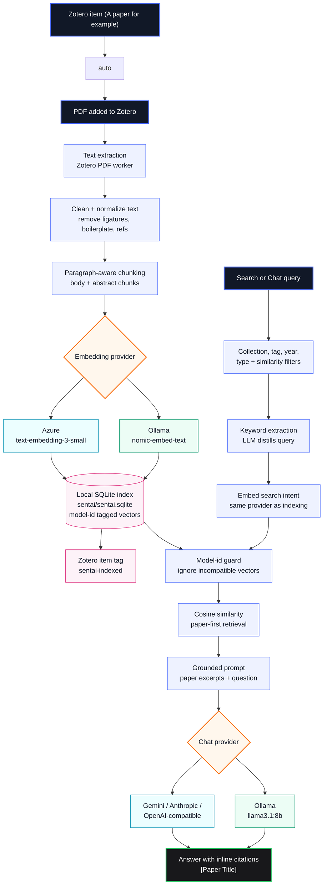
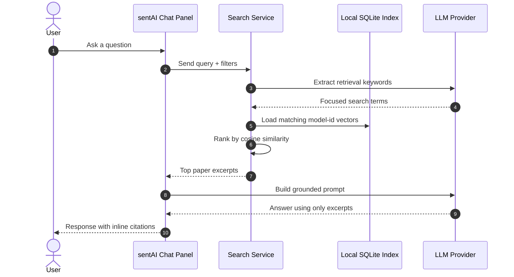

<div align="center">

# sentAI

**Semantic search for your Zotero research library**

[](https://www.zotero.org)
[](https://www.gnu.org/licenses/agpl-3.0)
[](https://www.typescriptlang.org)

_Stop ctrl+F-ing through papers. Ask your library what it knows._

</div>

---

sentAI is a Zotero 9 plugin that indexes your PDFs as semantic vectors and lets you search them by **meaning** using cosine similarity. Powered by our server as default or a provider of your choice. All data is stored locally and is not saved anywhere outside of your device.

## How it works





## Features

|                          |                                                                                                                         |
| ------------------------ | ----------------------------------------------------------------------------------------------------------------------- |
| **Auto-indexing**        | Every PDF you add is chunked and embedded automatically                                                                 |
| **Auto-attach**          | Items without a PDF trigger a download attempt before indexing                                                          |
| **Semantic search**      | Cosine similarity over your full library, surfacing the most relevant passages                                          |
| **RAG answers**          | Chat tab calls Gemini 2.5 Flash, answering from retrieved chunks with inline paper citations                            |
| **Keyword extraction**   | A lightweight Gemini Flash Lite call distils your question into search terms before embedding — better retrieval signal |
| **Collection filter**    | Restrict any search to a specific Zotero collection via a dropdown in the Search tab                                    |
| **Similarity threshold** | Configurable minimum score (default 10 %) — chunks below it never reach the LLM                                         |
| **References filtering** | Indexing stops at "References" / "Bibliography" headings — no citation lists in the index                               |
| **Two-tab UI**           | **Search** tab for direct semantic search with scored result cards; **Chat** tab for RAG answers                        |
| **Result cards**         | Title, match score %, 2-line snippet, author / year / journal chips                                                     |
| **Fully local storage**  | Vectors live in your Zotero data directory — only embedding and LLM requests hit the cloud                              |

## Requirements

- [Zotero 9](https://www.zotero.org)


## Usage

1. Download the latest deployment (file ending with .xpi)
2. Add it to Zotero (https://www.zotero.org/support/plugins)
3. Enable it in Zotero Plugin Settings
4. Open sentAI window by clicking its icon next to the default search field
5. Use "Search" tab to use semantic search directly or "Chat" tab if you want a more interactive session

Each result shows the paper title, a similarity score, and the matching passage.

## Local mode (Ollama)

Run embeddings and/or chat entirely on your own machine instead of Azure/Gemini — no API keys, nothing leaves your computer.

**1. Install Ollama**

```sh
brew install ollama
```

**2. Start it as a background service**

```sh
brew services start ollama
```

**3. Pull the models**

```sh
ollama pull nomic-embed-text   # embeddings
ollama pull llama3.1:8b        # chat / RAG answers
```

**4. Enable it in sentAI**

Open the Chat panel → ⚙️ Settings → check **"Use local Ollama (embeddings + chat)"** → Save.
Since it is a different model, you will need to reindex articles.